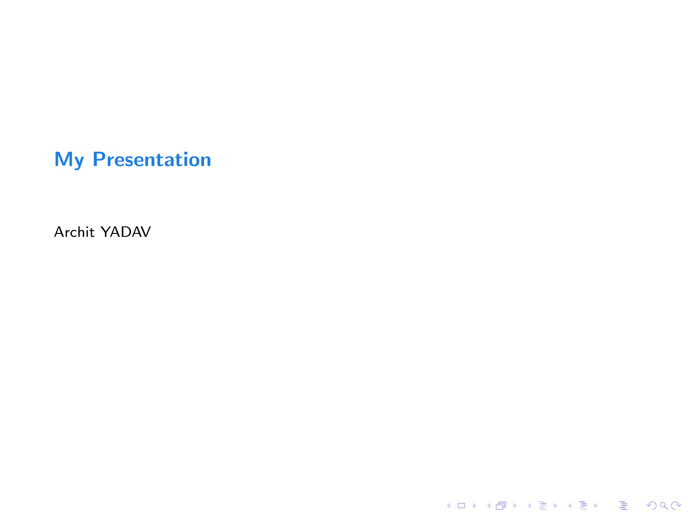
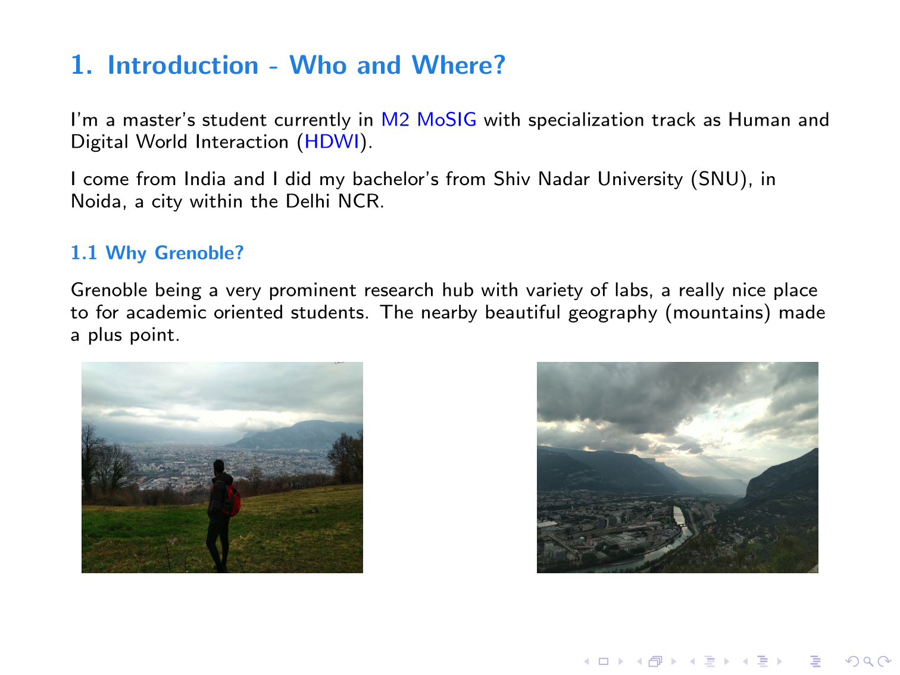
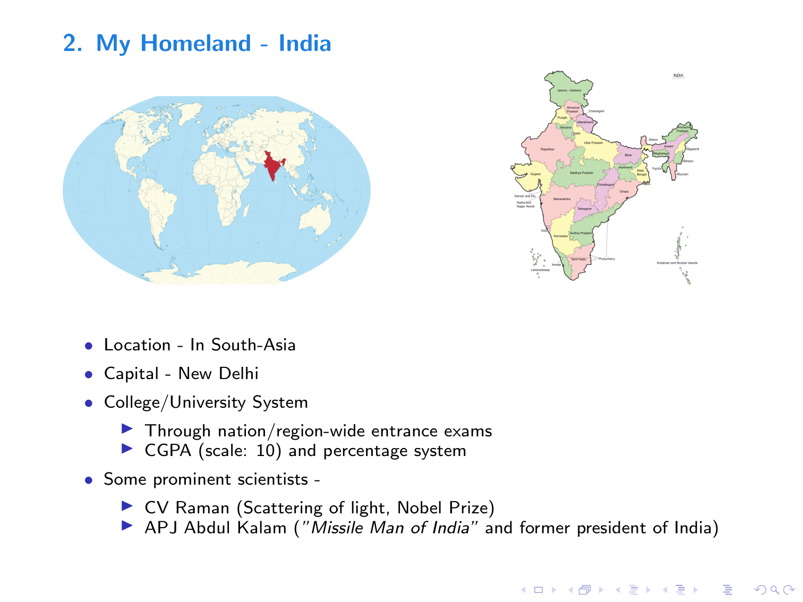

# LaTeX Workshop

LaTeX workshop held at UGA as part of orientation programme for M2 master's students

## Objective

After being explained some of the basic notions of LaTeX, we were asked to prepare presentation slides (2-4 pages) using a beamer template in LaTeX, as also mentioned in [intro_latex.pdf](./Latex_UGA/intro_latex.pdf).

## Presentation

PDF generated from LaTeX file can be found at [archit_presentation.pdf](./archit_presentation.pdf).

<table align=left>
  <tbody>
    <tr>
      <!-- Cell 1 -->
      <td style="text-align: center; vertical-align: middle;"> 
      
       </td>
      <!-- Cell 2 -->
      <td style="text-align: center; vertical-align: middle;"> 
      
       </td>
    </tr>
    <tr>
      <!-- Cell 3 -->
      <td style="text-align: center; vertical-align: middle;"> 
      
       </td>
      <!-- Cell 4 -->
      <td style="text-align: center; vertical-align: middle;"> 
      
       </td>
    </tr> 
  </tbody>
</table>
